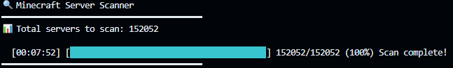

# MCprobe

High-performance Minecraft server scanner and protocol prober
MCprobe scans Minecraft servers using the native Minecraft protocol to efficiently collect server metadata at scale.

---

## Features

Scans servers to collect:
- MOTD and favicon
- Version and protocol
- Player counts and sample players
- Authentication mode
  - Online
  - Offline
  - Whitelist

---

## Performance & Design

MCprobe is designed for speed and scalability:
- Written in async Rust using Tokio
- Built for high-throughput scanning
- Handles:
  - Compression
  - Protocol differences (1.8+)
  - Connection timeouts

---

## 📊 Benchmark

- **Total IPs scanned:** 150,000
- **Time:** ~8 minutes
- **Concurrency:** 500
- **Protocol:** Native Minecraft handshake
- **Auth mode detection:** Online / Offline / Whitelist

### Terminal Output

## Input

input.txt
- One IP per line
- Format: IP[:PORT]
- If no port is provided, defaults to 25565

Example:
127.0.0.1

---

## Output

results.json
- Structured JSON scan results
  
Example Output:

---

## Usage

cargo run --release

---

## Disclaimer

Users are responsible for ensuring compliance with local laws and regulations when scanning servers.
